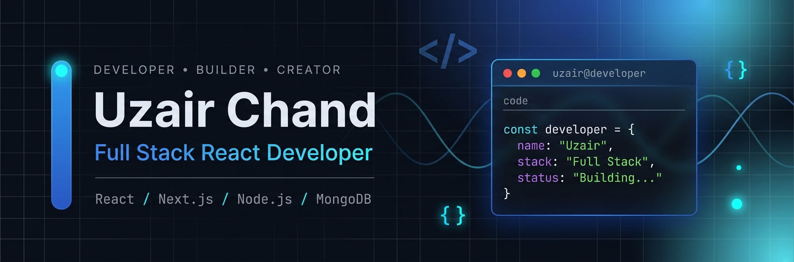

<p align="center">
  
</p>
# Hi, I'm Uzair Chand 👋

### Full-Stack React Developer 🚀

I build modern, responsive, and interactive web applications with a strong focus on clean UI, smooth animations, reusable components, and practical functionality.

My development journey started with **HTML and CSS** and progressed through **Tailwind CSS, JavaScript, React.js, Next.js, Node.js, Express.js, MongoDB, REST APIs, Git, and GitHub**.

I enjoy turning ideas into real-world applications — from creative websites and personal portfolios to dashboards, POS systems, business websites, and full-stack applications.

---

## 🚀 What I Build

- Full-stack web applications
- SaaS platforms
- Modern React applications
- Interactive & animated websites
- Business websites
- Admin dashboards
- POS & order management systems
- REST API based applications
- Responsive user interfaces

---

## 🛠 Tech Stack

### 👨‍💻 Languages

<p>
  
</p>

### ⚛️ Frontend Development

<p>
  
</p>

### 🎨 Animation & UI

<p>
  
</p>

**Also worked with:** Framer Motion · Responsive Design · Modern UI/UX

### ⚙️ Backend Development

<p>
  
</p>

### 🗄️ Database

<p>
  
</p>

### 🧰 Tools & Platforms

<p>
  
</p>

### ☁️ Services

<p>
  
</p>

**Also worked with:** Cloudinary · EmailJS · Stripe · PayPal
---

## 🚀 Featured Projects

### 💻 Personal Portfolio

Modern personal portfolio with interactive sections, responsive design, and smooth animations.

**React · Tailwind CSS · GSAP · Framer Motion · React Router**

---

### 🍕 SliceHub — Pizza Shop POS

POS system for managing tables, orders, menu items, payments, and staff roles.

**React · Tailwind CSS · Node.js · Express.js · MongoDB · REST API**

---

### ☕ Brew & Bean — Animated Coffee Website

Animated coffee website with a premium design, responsive layout, and interactive user experience.

**Next.js · React · Tailwind CSS · Framer Motion**

---

### 💧 Water Plant Website

Corporate website for a water filtration company with modern sections, animations, and responsive design.

**React · Tailwind CSS · Framer Motion · GSAP**

---

### ⚛️ React Projects

Collection of React applications covering state management, forms, CRUD operations, API integration, and reusable components.

**React · JavaScript · React Router · REST APIs**

## 📊 GitHub Stats

<p align="center">
  

  
</p>

---
## 🎯 Development Journey

```text
Web Fundamentals
       ↓
Frontend Development
       ↓
React Development
       ↓
Modern UI & Animations
       ↓
API Integration
       ↓
Next.js
       ↓
Backend Development
       ↓
Node.js + Express
       ↓
MongoDB + REST APIs
       ↓
Full-Stack Development
---


```

## 💡 What I Believe

> Great applications are built by combining clean code, thoughtful design, useful functionality, and continuous learning.

I believe in **learning by building** — taking ideas, turning them into projects, solving problems along the way, and improving with every application I create.

---

## 🔭 Currently Working On

- 🚀 Building full-stack web applications
- ⚛️ Developing React & Next.js projects
- ⚙️ Building backend APIs with Node.js & Express
- 🗄️ Working with MongoDB & REST APIs
- 🏢 Developing SaaS and business management systems
- 🎨 Creating modern interactive & animated websites
MongoDB
  ↓
REST APIs
